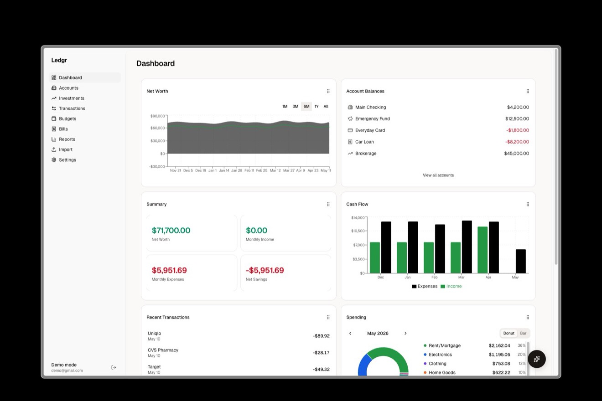
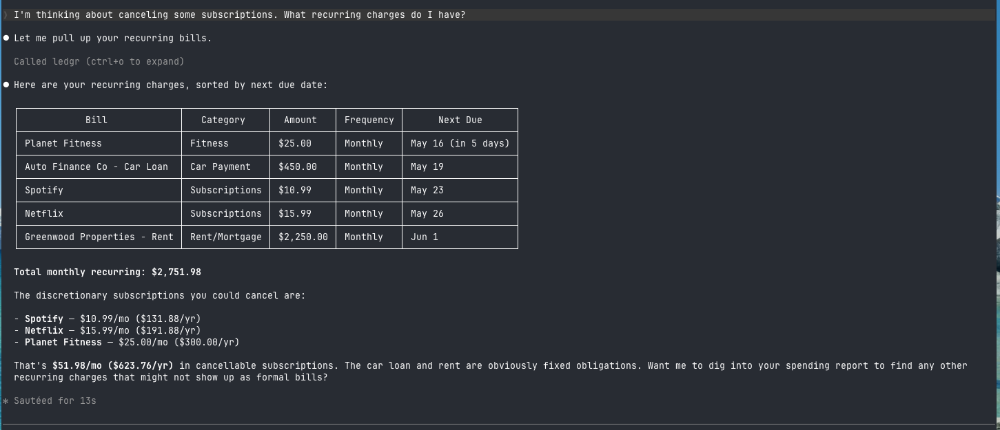
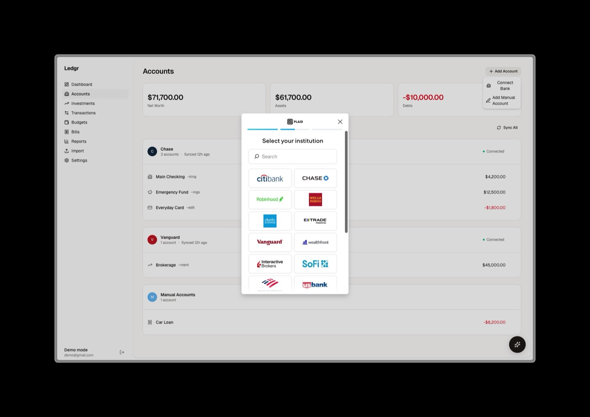

<div align="center">


# Ledgr

**Self-hostable personal finance app with automatic bank sync and AI agent support.**

[](https://www.gnu.org/licenses/agpl-3.0)
[](https://www.typescriptlang.org/)
[](https://nextjs.org/)
[](https://www.docker.com/)
[](https://modelcontextprotocol.io)



</div>

---

Ledgr connects to your bank accounts through [Plaid](https://plaid.com), automatically syncs and categorizes transactions, and gives you budgets, investment tracking, bill detection, and financial reports — all running on your own server with your own data.

It also exposes an [MCP](https://modelcontextprotocol.io) server, so AI assistants like Claude can query your finances through natural conversation.

```
You: "How much did I spend on dining out last month?"
Claude: Based on your transactions, you spent $342.18 on dining out in April...
```

<div align="center">

<br />
<em>Querying your finances from Claude Code via MCP</em>
</div>

## Features

- **Automatic bank sync** — connect 12,000+ banks via Plaid, with real-time webhook sync or scheduled polling
- **Smart categorization** — four-tier pipeline: your rules > merchant defaults > Plaid categories > AI fallback
- **Budgets** — set monthly budgets by category, track progress in real time
- **Investment tracking** — portfolio holdings, performance history, and allocation breakdowns
- **Recurring bill detection** — automatically identifies subscriptions and recurring charges
- **Financial reports** — spending, income, net worth, and category trends over time
- **AI agent interface (MCP)** — query your finances from Claude Code, Claude Desktop, Cursor, or any MCP client
- **In-app AI chat** — ask questions about your finances right from the dashboard
- **BYOK AI** — bring your own API key (OpenAI, Anthropic, Google, or local models) for chat and categorization
- **CSV/OFX/QFX import & CSV export** — for accounts not supported by Plaid, and for getting your data out
- **Self-hosted** — Docker Compose with PostgreSQL, your data never leaves your server

## Quick Start

Requires [Docker](https://docs.docker.com/get-docker/) and [Docker Compose](https://docs.docker.com/compose/install/).

```bash
mkdir ledgr && cd ledgr
curl -O https://raw.githubusercontent.com/KenTaniguchi-R/ledgr/main/docker-compose.yml
docker compose up -d
```

Visit `http://localhost:4200`, create an account, and start exploring.

On first boot, Ledgr generates an encryption key and session secret and stores them in the app data volume. **Back up that volume (or the `/data/encryption-key` file) along with your database** — losing the key means losing access to encrypted data like Plaid tokens. Prefer to manage the key yourself? Set `ENCRYPTION_KEY` in a `.env` file (see [Configuration](#configuration)) and it takes precedence.

> Add your Plaid keys to `.env` to enable bank sync — see [Connect Your Bank](#connect-your-bank) below. The app works without Plaid via CSV import.

## Connect Your Bank

1. Sign up at [dashboard.plaid.com](https://dashboard.plaid.com/signup) and get your `client_id` and secret from [Developers > Keys](https://dashboard.plaid.com/developers/keys)
2. Add them to a `.env` file next to your `docker-compose.yml` (start from [`.env.example`](.env.example) if you don't have one):
   ```env
   PLAID_CLIENT_ID=your_client_id
   PLAID_SECRET=your_secret
   PLAID_ENV=production      # or sandbox for fake data
   ```
3. Restart: `docker compose restart`
4. In the app, go to **Accounts > Link Bank** to connect via Plaid

> Plaid's free trial plan includes 10 production connections and unlimited sandbox access. After that, the Launch plan is pay-as-you-go with no contract. Don't have Plaid keys yet? The app still works — import transactions via CSV and add Plaid later.

<div align="center">

<br />
<em>Connect any of 12,000+ banks through Plaid</em>
</div>

## Connect Your AI Agent

Ledgr ships with a built-in [MCP](https://modelcontextprotocol.io) server and plugin support.

First, enable the MCP endpoint in your `.env` and restart:

```env
MCP_ENABLED=true
```

Then pick your tool:

**Claude Code**
```bash
/plugin marketplace add KenTaniguchi-R/ledgr
/plugin install ledgr@ledgr
```

**Codex CLI**
```bash
codex plugin marketplace add KenTaniguchi-R/ledgr
```

**OpenCode** — add to `opencode.json`:
```json
{
  "$schema": "https://opencode.ai/config.json",
  "plugin": ["ledgr"]
}
```

**OpenClaw**
```bash
openclaw plugins install ledgr --marketplace KenTaniguchi-R/ledgr
```

**Hermes**
```bash
hermes plugins install KenTaniguchi-R/ledgr
```

<details>
<summary>Other MCP clients (Cursor, Windsurf, Cline, etc.)</summary>

Point any MCP-compatible client to your Ledgr instance:

```
http://localhost:4200/api/mcp
```

On first connection, Ledgr redirects you through an OAuth flow to authorize access.

</details>

### Available Tools

| Tool | Description |
|------|-------------|
| `list_accounts` | Linked bank accounts and balances |
| `get_account_summary` | Balance totals by account type |
| `get_transactions` | Search and filter transactions |
| `update_transaction_category` | Recategorize a transaction |
| `get_budget` | Budget progress for a month |
| `set_budget_category` | Set a category's budget amount |
| `list_categories` | Spending categories |
| `get_spending_report` | Spending breakdown over a date range |
| `get_income_vs_expense` | Income vs. expense trends |
| `get_net_worth_history` | Net worth over time |
| `get_holdings` | Investment portfolio holdings |
| `get_portfolio_summary` | Portfolio value and allocation |
| `get_upcoming_bills` | Recurring transactions and bills |
| `get_dashboard_summary` | Overview of your finances |
| `show_financial_dashboard` | Interactive dashboard widget |
| `sync_accounts` | Trigger a bank sync |

Read, write, and sync tools are gated by OAuth scopes (`ledgr:read`, `ledgr:write`, `ledgr:sync`) that you grant during authorization.

**Example prompts:**
- "How much did I spend on groceries this month?"
- "Show me my budget status"
- "What recurring bills do I have?"
- "Generate a spending report for Q1"
- "Sync my accounts and show my balances"

## Comparison

| | Ledgr | Actual Budget | Firefly III | Maybe Finance |
|---|:---:|:---:|:---:|:---:|
| Automatic bank sync | Plaid (12,000+ banks) | GoCardless (EU) | Spectre/GoCardless | -- |
| AI agent (MCP) | Yes | -- | -- | -- |
| AI categorization | Yes (BYOK) | -- | -- | -- |
| Investment tracking | Yes | -- | -- | Yes |
| Self-hostable | Yes | Yes | Yes | Yes |
| Database | PostgreSQL | SQLite | MySQL/Postgres | Postgres |
| License | AGPL-3.0 | MIT | AGPL-3.0 | AGPL-3.0 |

## Updating

```bash
docker compose pull
docker compose up -d
```

Migrations run automatically on container startup.

## Configuration

| Variable | Required | Default | Description |
|----------|----------|---------|-------------|
| `ENCRYPTION_KEY` | No | auto-generated | Encrypts Plaid tokens & API keys. Generated on first boot and persisted in the app data volume; set your own with `openssl rand -hex 32` |
| `BETTER_AUTH_SECRET` | No | auto-generated | Session secret, persisted in the app data volume. Set your own with `openssl rand -base64 32` |
| `PORT` | No | `4200` | Host port for the app |
| `POSTGRES_PASSWORD` | No | `ledgr` | Database password (change in production) |
| `PLAID_CLIENT_ID` | No | -- | Plaid client ID |
| `PLAID_SECRET` | No | -- | Plaid secret key |
| `PLAID_ENV` | No | `production` | `production` or `sandbox` |
| `PLAID_SYNC_MODE` | No | `poll` | `poll` (scheduled) or `webhook` (real-time) |
| `PLAID_WEBHOOK_URL` | No | -- | Public URL for Plaid webhooks (webhook mode) |
| `AI_PROVIDER` | No | -- | `openai`, `anthropic`, `google`, or `custom` |
| `AI_API_KEY` | No | -- | Provider API key for AI chat & categorization |
| `MCP_ENABLED` | No | `false` | Enable the MCP endpoint for AI agents |

See [`.env.example`](.env.example) for all options.

## Development

> **If you're self-hosting Ledgr, use the [Quick Start](#quick-start) above.** The instructions below are for contributors.

### Prerequisites

- [Node.js](https://nodejs.org/) 24+
- [pnpm](https://pnpm.io/) 10+
- PostgreSQL 18 (or `pnpm dev:db` to start one in Docker)

### Setup

```bash
git clone https://github.com/KenTaniguchi-R/ledgr.git
cd ledgr
pnpm install
cp .env.example .env        # Fill in ENCRYPTION_KEY
pnpm dev:setup              # Start DB + migrate + dev server
```

To run the full app in Docker from source (instead of pulling the pre-built image):

```bash
docker compose -f docker-compose.yml -f docker-compose.dev.yml up -d
```

### Commands

```bash
pnpm dev                    # Dev server (Turbopack)
pnpm test                   # Unit + integration tests
pnpm test:e2e               # Playwright E2E tests
pnpm lint                   # ESLint
pnpm typecheck              # Type checking
pnpm db:studio              # Drizzle Studio (DB browser)
```

## Tech Stack

| Layer | Choice |
|-------|--------|
| Framework | Next.js 16 (App Router) |
| Language | TypeScript |
| UI | shadcn/ui + Tailwind CSS 4 |
| Charts | Recharts 3 |
| Database | PostgreSQL 18 via Drizzle ORM |
| Auth | Better Auth |
| Bank Sync | Plaid Node SDK |
| AI | Vercel AI SDK (BYOK) |
| MCP | Model Context Protocol SDK |
| Testing | Vitest + Playwright + Stryker |

## Roadmap

- [x] Plaid webhook support (real-time sync)
- [x] AI chat assistant (in-app)
- [x] OFX/QFX import
- [ ] Mobile-responsive UI
- [ ] Multi-currency support
- [ ] Custom report builder
- [ ] Automatic transfer detection between accounts
- [ ] Goal tracking (savings goals, debt payoff)
- [ ] Recurring budget templates

See [Issues](https://github.com/KenTaniguchi-R/ledgr/issues) for what's being worked on.

## Security

Security is critical for a finance app. If you discover a vulnerability, **please do not open a public issue.** Instead, see [SECURITY.md](SECURITY.md) for responsible disclosure instructions.

For details on how Ledgr handles your data, see [PRIVACY.md](PRIVACY.md).

## Contributing

Contributions are welcome! Please open an issue first to discuss what you'd like to change. See [CONTRIBUTING.md](CONTRIBUTING.md) for setup and workflow details.

1. Fork the repo
2. Create your branch (`git checkout -b feat/my-feature`)
3. Commit your changes
4. Push and open a Pull Request

## License

[AGPL-3.0](LICENSE) — you can self-host freely. If you modify and distribute the server, you must open-source your changes.
